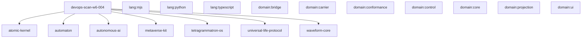

```mermaid
graph TD
  W[devops-scan-w6-004]
  W --> P_atomic_kernel[atomic-kernel]
  W --> P_automaton[automaton]
  W --> P_autonomous_ai[autonomous-ai]
  W --> P_metaverse_kit[metaverse-kit]
  W --> P_tetragrammatron_os[tetragrammatron-os]
  W --> P_universal_life_protocol[universal-life-protocol]
  W --> P_waveform_core[waveform-core]
  L_mjs[lang:mjs]
  L_python[lang:python]
  L_typescript[lang:typescript]
  D_bridge[domain:bridge]
  D_carrier[domain:carrier]
  D_conformance[domain:conformance]
  D_control[domain:control]
  D_core[domain:core]
  D_projection[domain:projection]
  D_ui[domain:ui]
```
