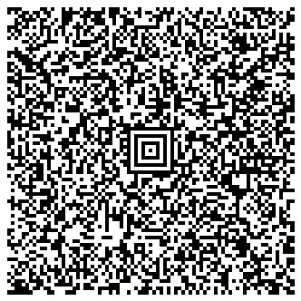
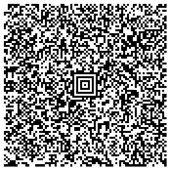
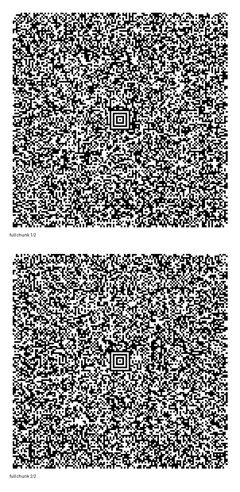

# Atomic Kernel

Deterministic replay substrate with mode-aware runtime laws, canonical hashing, and cross-language conformance checks.

For full docs, start at [docs/README.md](./docs/README.md).

## Architecture


One-sentence model:
`Bits -> canonical algorithms -> deterministic clock -> canonical artifact -> dual identity -> platform adapters`

Parallel prototype lane:
`direct-byte canonical package v2` where carrier outputs are reversible advisory projections.

Three rules:
1. The specification is normative: `AK-ALG-01..04` define canonical behavior.
2. The reference implementation is illustrative: any implementation with the same canonical outputs is valid.
3. Artifacts are the verification boundary: same canonical artifact + identity means semantic agreement.

Normative layers:
- Mathematical Law
- Canonical Algorithms
- Identity Rules
- Artifact Format

Non-normative layers:
- Reference implementation
- Platform adapters
- Visualization / APIs

## Quick Start
```bash
./ak all
```

Open dashboard: `http://127.0.0.1:8080`
Message demo: `http://127.0.0.1:8080/message-demo`
Static message demo: `message-demo-static.html` (open directly) or `http://127.0.0.1:8080/message-demo-static`

## What Is Implemented
- Mode-aware replay: `mode=kernel` and `mode=16d`
- Deterministic canonical artifacts (`sha3_256:` digests)
- Parallel identity outputs: hash-tagged replay IDs (`v1`) and math-only IDs (`math_id_v2`)
- SID/OID verification path
- Fail-closed control-plane validation
- Authority decision gate
- Haskell oracle parity endpoint and conformance gate

## Proof Boundary
- `Implemented`: present in repository code and callable interfaces.
- `Verified`: supported by reproducible commands listed below.
Evidence: `python3 tests/test_all.py`, `python3 tests/test_v1.py`, `python3 conformance.py`
- `Conjecture/Open`: not release-authoritative.

Evidence:
- Core deterministic suite: `python3 tests/test_all.py`
- Mode-aware + API + Aztec bundle suite: `python3 tests/test_v1.py`
- Cross-language conformance: `python3 conformance.py`

## Key Commands
```bash
# API + dashboard
./ak serve

# Full verification gate
./ak verify
# (includes Coq parity gate and golden artifact equality)

# Coq normative check (no Admitted/Axiom + coqchk)
./ak coq-verify

# Coq gate: Print Assumptions closure + Coq/Python parity + golden artifact
./ak coq-parity

# Emit Coq-derived replay artifact JSON
./ak coq-artifact --width 16 --seed 0x0001 --steps 8 --coq-out coq-artifact/artifact.json

# Verify, then start server
./ak all

# Offline message -> artifact + chunks (+ optional chunk PNG render)
./ak message-artifact --message "Hello, world" --outdir message-artifact

# Build scan-ready Aztec chunk payloads from replay artifact
./ak aztec-pack --mode 16d --width 32 --seed 0x0B7406AC --steps 64 --outdir aztec-bundle

# Build proof-layer bundles (control codes, algorithms, full artifact)
./ak aztec-proof --outdir aztec-proof

# One-time renderer setup
python3 -m venv .venv
.venv/bin/pip install aztec-code-generator pillow

# Render README PNGs from proof bundles (uses .venv aztec renderer)
./ak aztec-images --proof-dir aztec-proof

# Reconstruct artifact from scanned chunk files
./ak aztec-unpack --indir aztec-bundle --output aztec-bundle/recovered.json

# Build/verify direct-byte canonical package (v2 prototype lane)
./ak package-v2-build --mode 16d --width 32 --seed 0x0B7406AC --steps 64
./ak package-v2-verify --package package-v2/package.json

# Build/decode v2 transport carriers (projection-only)
./ak package-v2-aztec-pack --package package-v2/package.json --outdir package-v2/aztec
./ak package-v2-aztec-unpack --indir package-v2/aztec --output package-v2/recovered-from-aztec.json
./ak package-v2-unicode-pack --package package-v2/package.json --output package-v2/unicode-projection.json
./ak package-v2-unicode-unpack --projection package-v2/unicode-projection.json --output package-v2/recovered-from-unicode.json

# v2 parity check (decoded package replay hash must match source artifact)
./ak package-v2-parity --mode 16d --width 32 --seed 0x0B7406AC --steps 64
```

## Canonical Artifacts - Scannable Proof
Use `./ak aztec-proof --outdir aztec-proof` to generate three deterministic payload sets:

- `aztec-proof/control-codes/` : UTF-EBCDIC control-plane contract payload
- `aztec-proof/algorithms/` : `AK-ALG-01..04` algorithm IDs and spec metadata
- `aztec-proof/full/` : full replay artifact payload

Each set contains:
- `manifest.json` with `aztec_profile`, ordering, descriptor parity, and digests
- `chunks/chunk-*.json` (one payload per Aztec symbol)
- `chunks.ndjson` (line-delimited chunk payloads for batch encoding)

Encode each chunk JSON as one Aztec symbol with your encoder of choice, then scan/decode back to JSON and run `./ak aztec-unpack` to verify reconstruction and digest integrity.

## Serverless Modes
- Offline CLI: `./ak message-artifact --message "..." --outdir ...`
- Static browser demo: open `message-demo-static.html` directly from disk.
- Optional HTTP wrapper: `./ak serve` for API-backed integrations and rendering endpoints.

## Python API
```python
from atomic_kernel import canonicalize

artifact = canonicalize("Hello, world")
print(artifact["stream_digest"])
```

| Image | Contains | Scan |
|---|---|---|
| **Control Codes** | UTF-EBCDIC control-plane contract |  |
| **Algorithms** | `AK-ALG-01` through `AK-ALG-04` |  |
| **Full Artifact** | Full replay artifact chunk set (stacked) |  |

## API Surface
- `POST /replay`
- `POST /replay/hash`
- `POST /control-plane/validate`
- `POST /identity/verify`
- `POST /authority/check`
- `POST /oracle/parity`

See [docs/api-reference.md](./docs/api-reference.md) for contracts and examples.

## Publication Notes
- Normative implementation guidance: [docs/concepts.md](./docs/concepts.md)
- Conformance contract: [docs/conformance.md](./docs/conformance.md)
- v1/v2 compatibility matrix: [docs/COMPATIBILITY_MATRIX_V1_V2.md](./docs/COMPATIBILITY_MATRIX_V1_V2.md)
- Claim policy: [docs/publication-claims.md](./docs/publication-claims.md)
- Release notes: [v1.0.0](./RELEASE_NOTES.md)

## Author Intent
This project is published as a serious, good-faith attempt to address a shared systems problem with deterministic, testable methods.
Claims are limited to what can be reproduced with the repository commands and fixtures today.
Future behavior is treated as open and must be re-verified over time.
The goal is practical collaboration on a verifiable artifact, not certainty beyond current evidence.

## License and Notice
- License: [CC0 1.0 Universal](./LICENSE)
- Notice and legal context: [NOTICE](./NOTICE)
