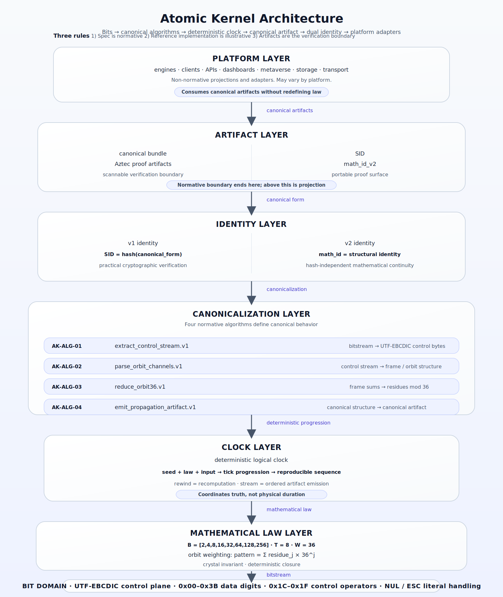

# Atomic Kernel Documentation

Version: v1.0  
Status: Published documentation for implemented runtime

This documentation is organized for developers who need to run, verify, and integrate Atomic Kernel quickly.

## Architecture At A Glance

One-sentence model:
`Bits -> canonical algorithms -> deterministic clock -> canonical artifact -> dual identity -> platform adapters`

Prototype v2 lane:
`canonical truth = direct package bytes`; carrier formats are reversible transport projections.
Constitutional sentence: **Canonical truth is the direct package bytes. Carriers are reversible projections only.**

Three rules:
1. The specification is normative (`AK-ALG-01..04`).
2. The reference implementation is illustrative.
3. Canonical artifacts are the verification boundary.

Normative layers:
- Mathematical Law
- Canonical Algorithms
- Identity Rules
- Artifact Format

Non-normative layers:
- Reference implementation
- Platform adapters
- Visualization / APIs

## Start Here
- [Getting Started](./getting-started.md)
- [API Reference](./api-reference.md)

## Core Documentation
- [Canonical Algorithms Specification (Normative)](./algorithms.md)
- [Concepts and Normative Boundaries](./concepts.md)
- [Conformance and Oracle Workflow](./conformance.md)
- [v1/v2 Compatibility Matrix](./COMPATIBILITY_MATRIX_V1_V2.md)
- [Publication Claim Policy](./publication-claims.md)
- [Release Checklist](./release-checklist.md)

## Canonical vs Archived Specs
- Canonical deterministic replay spec: [Canonical Algorithms Specification](./algorithms.md)
- Canonical control-plane spec: [Canonical Algorithms Specification](./algorithms.md)
- Archived duplicate deterministic replay draft: `../dev-docs/Technical Specification_ The Atomic Kernel Deterministic Replay Substrate (1).md`

## Research Appendix
- [Research Appendix Index](../dev-docs/research-appendix.md)
